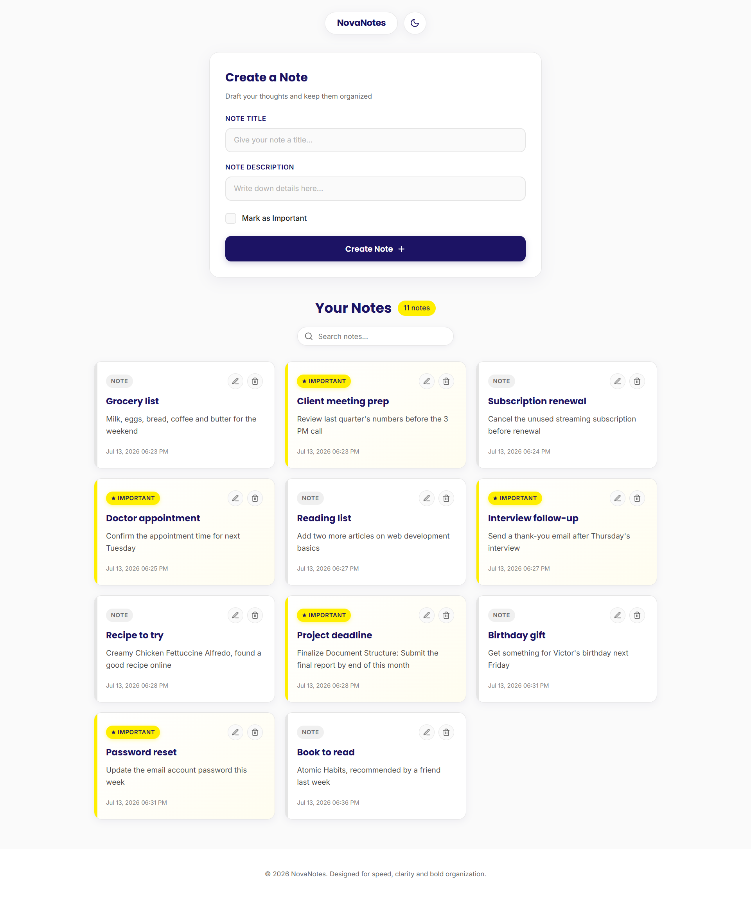
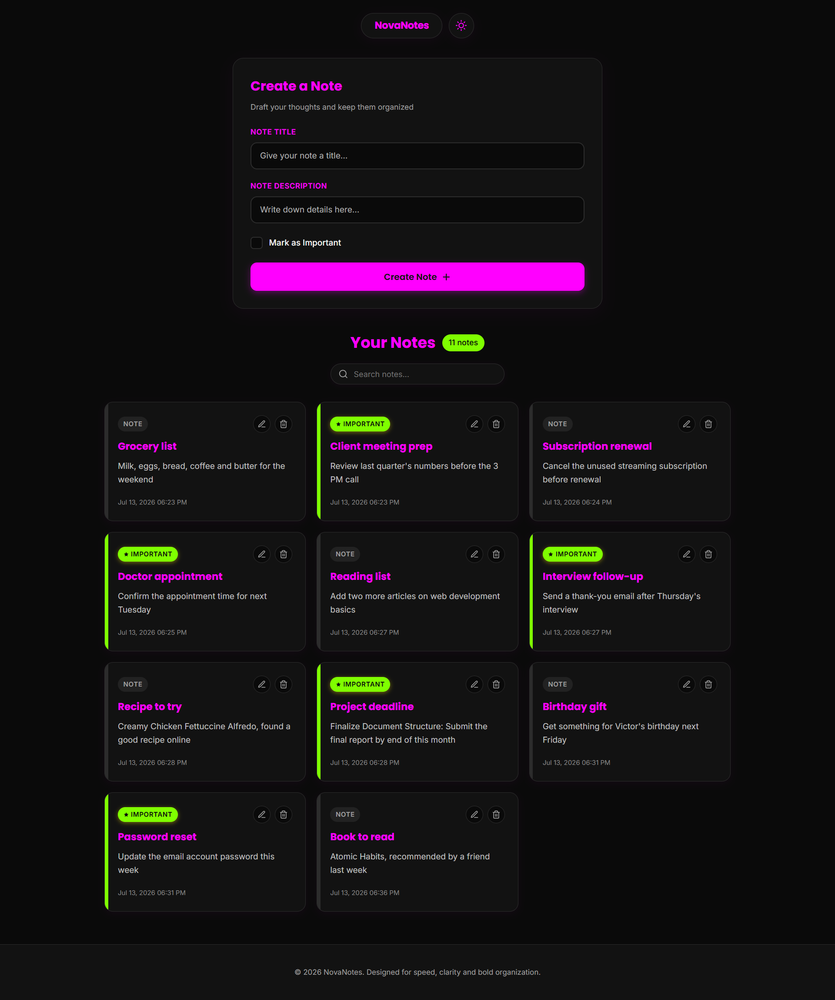

# NovaNotes | FastAPI & MongoDB Notes App

**Scope:** Single-page / FastAPI + MongoDB practice project

A simple, modern single-page notes app built with FastAPI, Jinja2 and MongoDB. Create, edit, delete and search notes, mark any note as important, and switch between light and dark themes.

---

## Screenshots

### Light Mode

### Dark Mode

---

## Project Overview

This project was built primarily as a hands-on learning exercise, with the main focus on practicing two things: building API endpoints and routes with FastAPI (routers, GET/POST handling, form validation, redirects) and connecting a real backend to MongoDB (reading and writing documents end to end).

The app is server-rendered — FastAPI renders the page through Jinja2 templates, while a small amount of client-side JavaScript handles in-page interactions like search, edit mode, delete confirmation, toasts and the theme toggle, without any separate frontend framework.

---

## Features

- Create, edit and delete notes
- Mark a note as important
- Live client-side search across note titles and descriptions
- Note count display, including live filtered count while searching
- Custom delete-confirmation modal
- Toast notifications for create, update, delete and validation errors
- Dark mode toggle
- Server-side input validation on title and description length

---

## Tech Stack

| Technology | Purpose |
| --- | --- |
| FastAPI | Backend framework, routes and page rendering |
| Jinja2 | HTML templating |
| MongoDB (Atlas) | Stores notes as documents |
| PyMongo | Python driver for MongoDB |
| Uvicorn | ASGI server |
| python-dotenv | Loads the database connection string from environment variables |
| HTML / CSS / JavaScript | Frontend structure, styling and interactivity |

---

## Project Scope

This project is intentionally designed for:

- A single shared notes list (no per-user accounts)
- Practicing FastAPI routing and MongoDB integration
- A single-page, form-driven UI

This version does not include:

- User authentication / login
- Multiple users or private notes
- Note categories, tags or pagination

---

## Future Improvements

- User authentication, so each user only sees their own notes
- Filter notes by "important" only

---

## License

This project is provided for educational purposes. See the [LICENSE](LICENSE) file for details.
